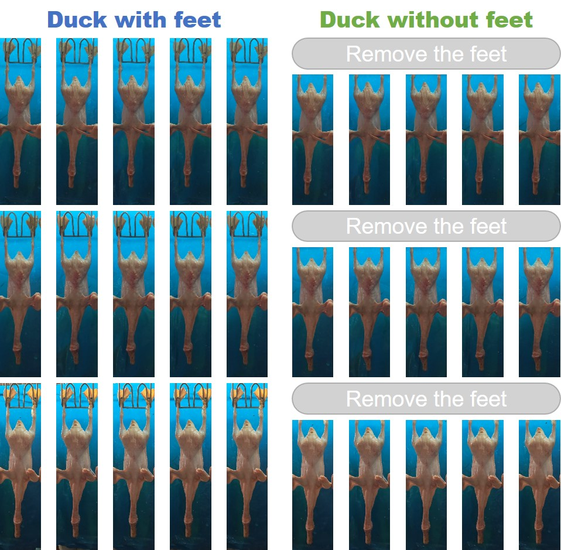
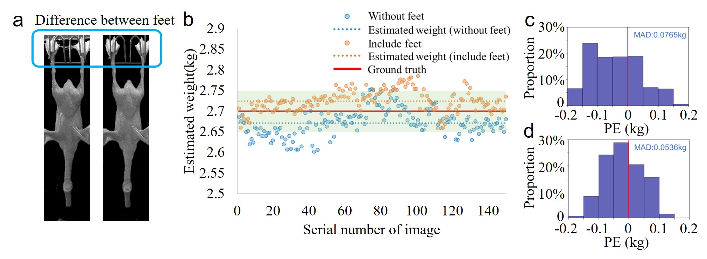

# Datasets of ducks using for image weighing

## 1. Introduction

This data sets is using for research in image weighing of ducks, which is one of our works' datasets, more details can visit our [project page](https://ruoyuchen10.github.io/Publications/image-weighing-1.html), if there is any question can connect with [Ruoyu Chen](https://ruoyuchen10.github.io/).

> Project page:  [https://ruoyuchen10.github.io/Publications/image-weighing-1.html](https://ruoyuchen10.github.io/Publications/image-weighing-1.html)
>
> Connect: cryexplorer@gmail.com

The dataset consist of 50 ducks, each duck consist around 150 images from different angle. Folder `duck_with_feet` contains the duck images with its feet, and folder `duck_without_feet` we remove the images' feet.  Some images are shown in the figure below:



## 2. Label

File `weight.txt` contain the weight label of each duck, as the format:

```shell
1	3.45
2	2.75 
3	2.45 
4	2.65 
5	2.40 
6	2.85 
7	2.70 
8	3.10 
9	2.95 
10	2.80 
...
```

The first column denote the number of the duck, second column denote the weight, the unit is ***kg***. For example:  `1     3.45` denote the image in path `./duck_with_feet/1/` and `./duck_without_feet/1/` is 3.45 ***kg***.

## 3. Problem of the feet

Due to the background is not strictly controlled at the time of collection, the duck feet area exist illumination difference. We try a deep learning model (details will open after the paper accepted) to compare the effect of if remove feet area:



(a) The area which light brightness to change greatly. (b) the estimated result of one duck based on the images from different angles. The PE distribution of the weight estimation (c)with feet and (d) without feet. 

So we suggest using the images of ducks without feet of this datasets.

## Acknowledgements

The dataset was collected in a duck husbandry factory (Shandong Hongye Food Co. Ltd., Shandong, China). Thanks to Dr. [Zhao Yuliang](http://graduate.neuq.edu.cn/info/1136/2790.htm) who connect with the factory.

## Citation

If you find our work useful in your project please cite us as

```python
@misc{Data_imgweighing,
	author = {Ruoyu, Chen and Yuliang, Zhao},
	title = {Datasets of ducks using for image weighing},
	howpublished={\url{https://github.com/RuoyuChen10/Duck_weight_datasets/}},
 	year = {2021}
}
```

